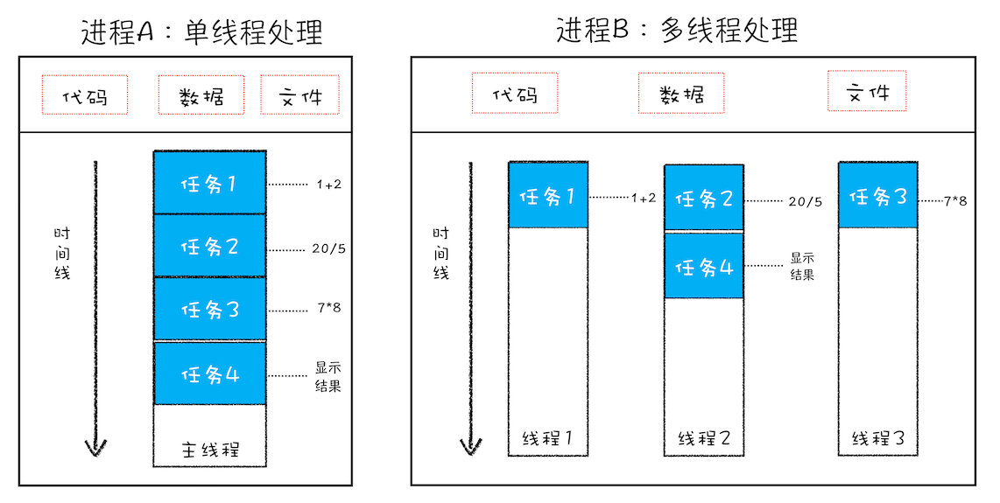
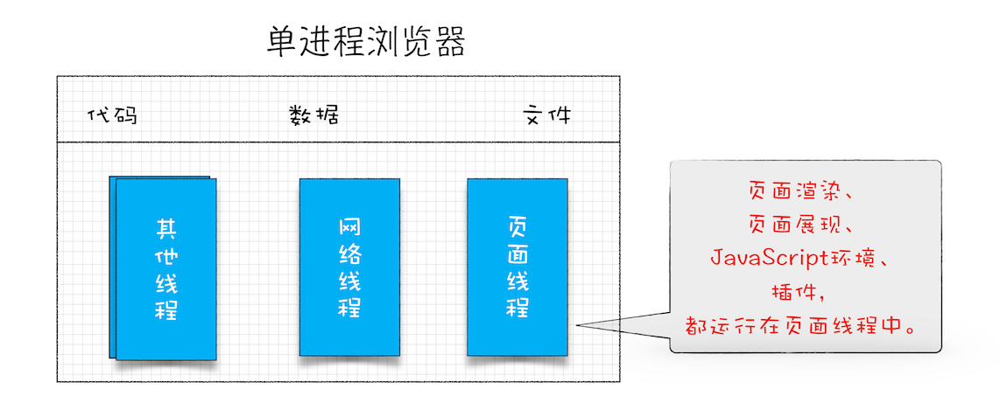
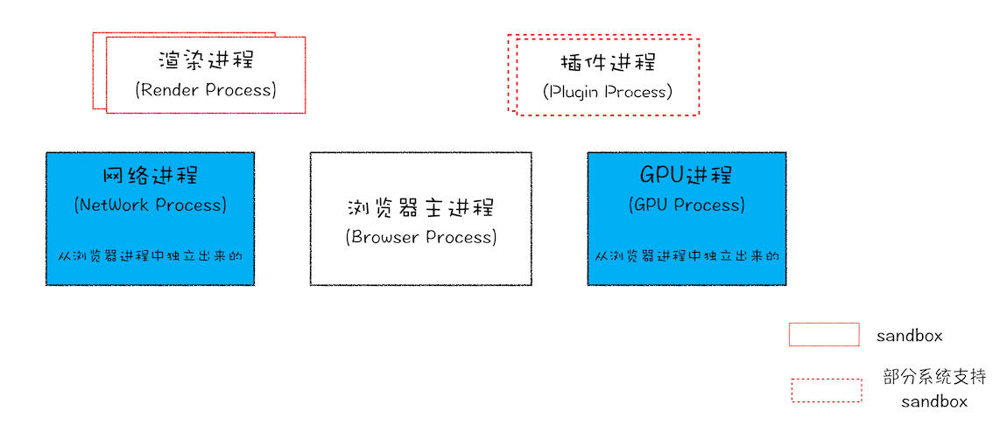

# 浏览器底层
- 当打开chrome的时候，意味着什么？
  
  启动了一个主进程 process    唯一的进程ID PID
  上网的代理程序
  分配资源的最小单位 
  线程 thread 执行程序的最小单位 
- 为什么是chrome？
  chrome 最优秀 市场占有率最高的
- 主要功能
  子进程
  - html/css 渲染页面 render
  - v8 引擎 执行js代码
    单线程 简单
  - 网络下载 network
    通信 
- 多线程多进程架构
  - 主进程 browser 
    负责管理和调度
    - GPU进程 显卡 显示 渲染 3D
      animation transltion translate3D
    - network 网络进程
    - Storage 进程 本地存储 缓存 LocalStorage Cookie 前端数据库

    - tab标签页是独立的子进程
      - 渲染进程 render process 渲染引擎 webkit 
      - JS 执行进程 v8 引擎
        JS 单线程 (主)  运行起来了

- 进程
  分配资源的最小单位
  每个tab页都是个独立的进程  内存开销大
  但 每个页面显示更快 更安全 
  如果进/线程 崩溃的话 所有的页面都玩完
  ie浏览器动不动就崩溃  多进程 多tab来做隔离

- 单线程
  同步任务(sync) 异步任务(async)放到event loop中
- 多线程 并行 
  线程共享进程资源

- 当一个进程关闭之后，操作系统会回收进程所占用的内存。
- 每一个进程只能访问自己占有的数据，不能访问其他进程的数据。如果崩溃也不会影响其他进程的运行。如果进程之间需要进行数据通信，利用IPC机制来实现

## 单进程浏览器ie

## chrome 多进程架构

- 浏览器进程
  主要负责界面显示 (浏览器软件界面),用户的交互,子进程管理,同时提供存储等功能
- 渲染进程
  核心任务是将html,css,javascript 转换为用户可以与之交互的网页
  排版引擎Blink
  渲染引擎Webkit 和JS引擎V8都运行在这里。
  默认情况下，chrome会为每一个tab界面创建一个渲染进程。
- GPU进程
  早期其实是没有的。GPU使用的初衷是为了实现3D CSS的效果，网页，UI都采用了GPU来绘制。显卡的加速
- 网络进程
  负责页面的网络资源加载，独立的进程
- 插件进程
  flash,chrome extension

- 当打开一个页面为什么会有多个进程？有哪些进程？                       
  浏览器进程
  渲染进程
  GPU进程
  网络进程
  插件进程
  

