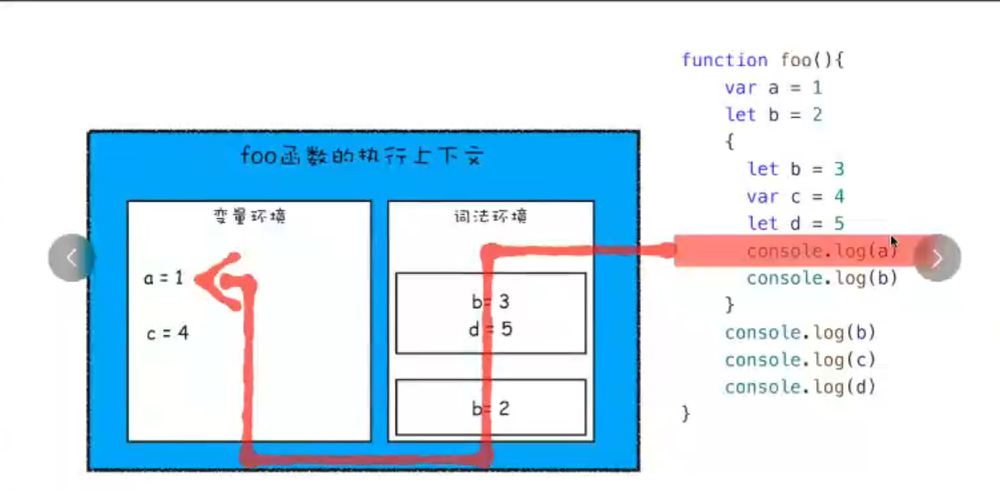
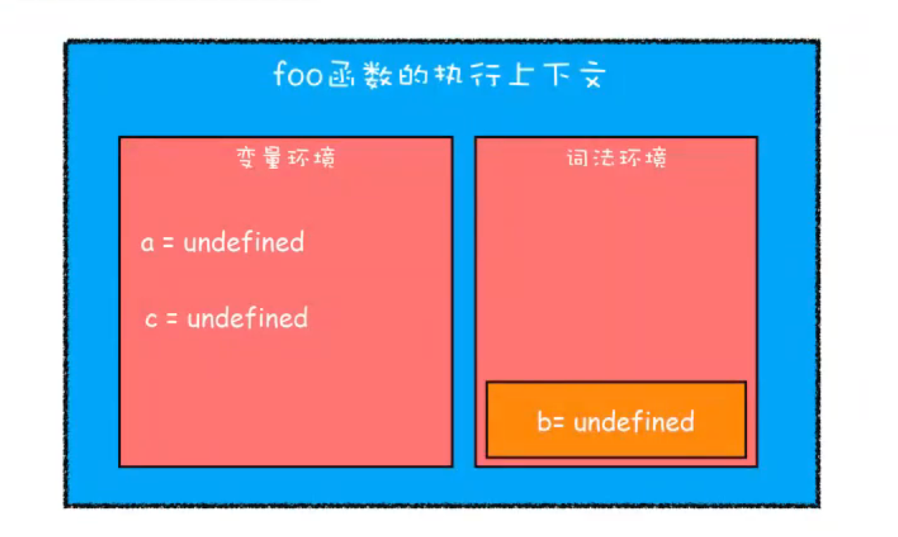
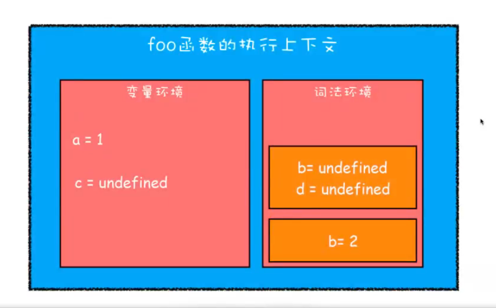

# 作用域 

## JS 执行机制
  - v8引擎
  - 两个阶段 编译和执行
  - 调用栈
    以函数为单位入栈，执行完成出栈 变量回收
    执行上下文
    变量环境 词法环境

- 变量提升 hoisting 
  - 正式由于JS 存在变量提升的特性，从而导致很多与直觉不符的代码，是JS设计缺陷
- 怎么解决的？
  - let const 暂时性死区中
  - 支持块级作用域 {} 
  - es6 里的正确 但是又要向下兼容 

## 一语言两制
  - let/const 放到词法环境中
  - var 放到变量环境中
- 为什么变量提升是缺陷 但早期还要这么设计呢？

## 作用域
变量查找的规则 
作用域链是变量的查找路径
作用域指在程序中定义变量的区域，该位置决定了变量的可见性、生命周期
作用域控制着变量和函数的可见性和生命周期 

- 全局作用域
  在任何地方都能访问，其生命周期就是页面周期
- 函数局部作用域
  只能在函数内部访问，其生命周期就是函数执行周期
- 块级作用域
  - es5 不支持块级作用域
  - es6 支持块级作用域 {}
  
- es5 变量提升不合理，不支持块级作用域 有关系
  js 当时是一个kpi项目，没想到会火起来，设计周期很短，为了浏览器商业竞争
  js 当初设计时就是为了给页面加动态效果
  - 比如面型对象，是最重要的软件思想，但设计起来比较复杂(class construtor super extends,public private)
  就采取了简单的大写函数(prototype + constructor)
  - 其他语言都支持块级作用域 而es5不用支持 为了简单设计。
  没有了块级作用域，再把作用域内部的变量统一提升到作用域的顶部
  ,是最快、最简单的设计。

## 变量提升带来的问题
- 变量容易在不被察觉的情况下被覆盖
  作用域会先使用函数执行上下文里面的变量
- 本应该销毁的变量没有被销毁

- JS如何在现在让变量提升和块级作用域统一和谐的？
  - 站在执行上下文的角度
  - var 放在变量环境中
  - let/const 放在词法环境中

- 第一步编译并创建执行上下文
  - 变量环境
    - 变量提升
  - 词法环境
    - 暂时性死区
    - 块级作用域
- 继续执行到块级作用域
  - 块级作用域中通过let、const 声明的变量，会被放在词法环境的一个单独的区域中
  - 在词法环境内部，维护了一个小型栈结构
    块级作用域执行时，首先会查找块级作用域里面的变量
      词法环境中找变量，在栈顶查找
    块级作用域执行完成后，出栈，可以确保外界不可访问

- es6 是如何支持块级作用域的？
  从执行上下文角度分析，是栈结构的词法环境

##  案例7.js

